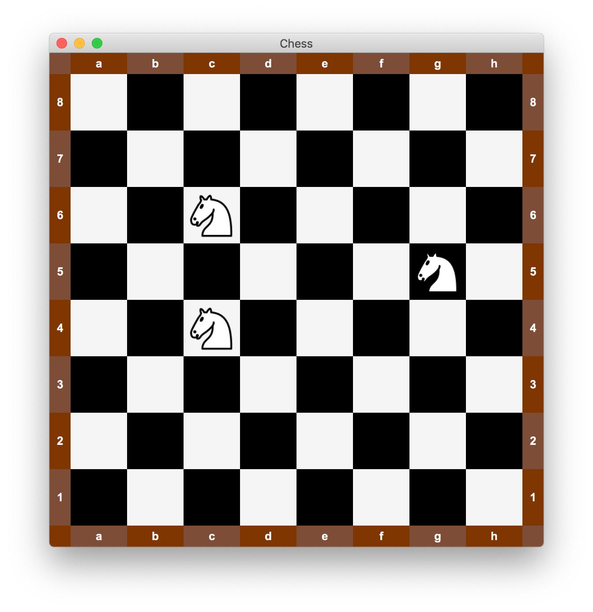

# TODO

Here is tracked what needs to be done.
The current development state, all the past, present and future tasks and issues including their time estimates.

See also [Chess Game Notes](./CHESS-GAME-NOTES.md) which contains some useful chess-related links.  
See also [Useful info](./USEFUL-INFO.md) which contains some useful Java-related links.

## Current state 👀

Project is fully setup (Maven, JavaFX 15, logging, unit testing).

Currently, basic **GUI for the chessboard is implemented**.
It is **fully responsive** (it automatically adapts according to the current window size).
It supports **moving chess pieces using drag and drop**. It is located in package
`cz.martinendler.chess.ui` and consists of the following classes: `Board`, `Square`, `Piece`,
`BorderSegment`, `BorderDescription`.

Furthermore, there is a PoC implementation of **app controllers** (package `cz.martinendler.chess.ui.controllers`).
They are designed to work with the `cz.martinendler.chess.ControllerFactory`
that **handles automatic dependency injection**.

## Plan 🗓️

It is regularly updated as the development progresses.

* **week 03 – 05**
    * work start, initial setup (Maven project, JavaFX 15, logging, testing)
* **week 06 – 07**
    * experiment with possible GUI chessboard implementations (responsive, drag and drop support)
    * skeletons for core project classes (game logic, GUI)
    * document project (features and goals, user, manual architecture)
* **week 08**
    * implement chess game logic in package `cz.martinendler.chess.engine`
        * game representation
        * chess rules
* **week 09**
    * connect the chess game logic with GUI of the chessboard (`cz.martinendler.chess.ui.Board`)
    * implement missing GUI parts for the chess game (moves log, optional chess clock)
* **week 10**
    * implement full app flow (menus, dialogs) – ability to create new game, save game, load, game, ...
    * implement global app preferences
* **week 11**
    * implement PGN, FEN, UCI
    * connect the whole app GUI (menus, dialogs, windows) with the business logic (model layer)
        (game loading, saving, incl. PGN, game against the computer using UCI engine)
* **week 12**
    * complete unfinished parts
* **week 13 – 14**
    * hopefully everything will be done
    * final submission

## Other notes

* build and export
    * copy `build.sh` and `build-pom.xml`
        from my [cookbook project](https://github.com/pokusew/fel-dbs-hw06)
    * copy `export.sh` and the appropriate section from `export/README.md`
        from my [cookbook project](https://github.com/pokusew/fel-dbs-hw06)
* sounds
    * add sound effects for:
        * chess piece moved
        * chess piece captured
        * invalid move attempted
