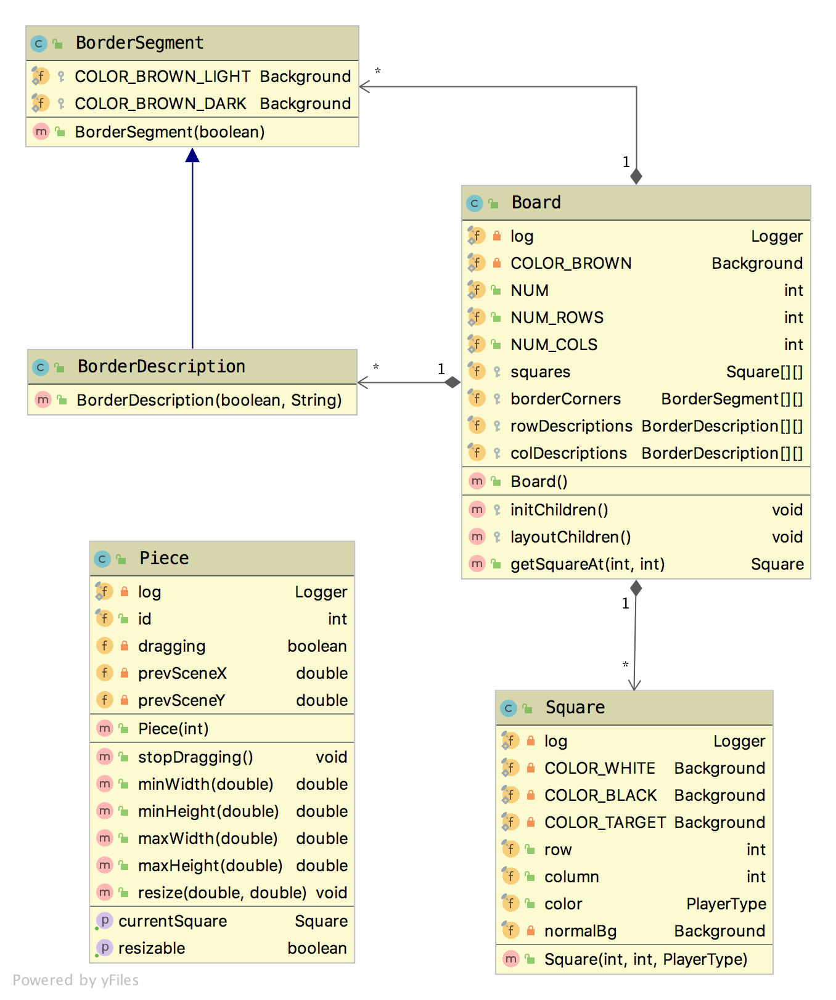

# Technical Manual

The Chess App is a Java desktop application powered by [JavaFX](https://openjfx.io/).


## Content

<!-- START doctoc generated TOC please keep comment here to allow auto update -->
<!-- DON'T EDIT THIS SECTION, INSTEAD RE-RUN doctoc TO UPDATE -->

- [Development](#development)
- [Used technologies and libraries](#used-technologies-and-libraries)
- [App architecture](#app-architecture)
  - [Class diagram](#class-diagram)

<!-- END doctoc generated TOC please keep comment here to allow auto update -->


## Development

**Requirements:**
* **Apache Maven 3.6+**
* **Java 11+** (tested with Java 15, note: Java 8 will NOT work)
* Make sure `JAVA_HOME` is properly set to a JDK 11+ installation directory. 

The project can be **run** using Maven CLI as follows:
```bash
mvn clean && mvn compile && mvn javafx:run
```

The project can be also **imported into Intellij IDEA** (_Open or Import_ or _File > New > Project from existing sources ..._ then select Maven ...).

The **executable fat JAR can be built** using:
```bash
./build.sh
```
The executable JAR with all dependencies output is `target/chess-1.0-SNAPSHOT-jar-with-dependencies.jar`.

It can be run as follows:
```bash
java -jar target/chess-1.0-SNAPSHOT-jar-with-dependencies.jar
```


## Used technologies and libraries

* Java 15
* [Apache Maven 3.6+](https://maven.apache.org/)
* [JavaFX 15](https://openjfx.io/)
* [JUnit 5](https://junit.org/junit5/) for unit tests
* [slf4j](http://www.slf4j.org/) and [logback](http://logback.qos.ch/) for logging


## App architecture

_Note: See also [current development state](../TODO.md)._

The game logic (chess rules) is independent of the GUI.

The following diagram briefly describes the packages and the classes:
```text
cz.martinendler.chess
├── engine - game logic
│   └── pieces - chess pieces
│   │   ├── Piece - abstract class for all pieces
│   │   ├── Pawn
│   │   ├── Rook
│   │   ├── Knight
│   │   ├── Bishop
│   │   ├── Queen
│   │   └── King
│   ├── Game - chess game state
│   ├── Board - chess board state
│   ├── PlayerType - enum (WHITE, BLACK)
│   ├── 
│   └──
├── ui - GUI
│   ├── controllers - FXML controllers
│   ├── routing - routing primitives
│   ├── Board - represents the chessboard
│   ├── BorderSegment - represents a border segment of the chessboard
│   ├── BorderDescription - represents a border segment with a text description
│   ├── Square - represents a square on the chessboard
│   └── Piece - represents a chess piece that can be placed on a square
├── ControllerFactory - handles dependency injection for FXML
├── App - JavaFX application, entrypoint
└── Main - entrypoint (calls App.main()) (bug workaround, see Main code)
```


### package: `cz.martinendler.chess.engine`

TODO: describe


### package: `cz.martinendler.chess.ui`

_Note: Only chessboard related classes are shown and described._

`Board` represents the chessboard. It extends from `javafx.scene.layout.Region`.
It handles positioning of its children nodes (instances of `Square` and `BorderSegment`) in `layoutChildren()`.
It is **fully responsive** (It automatically adapts the layout according to the available width from its parent).
 
`Sqaure` represents a square on the chessboard. It is a container for a `Piece`.
When a `Piece` is dropped on a `Sqaure`, the `Square` make the `Piece` its child node.


