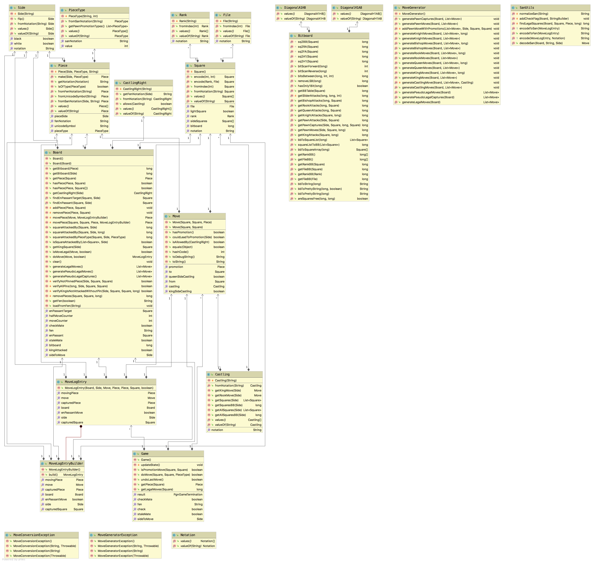
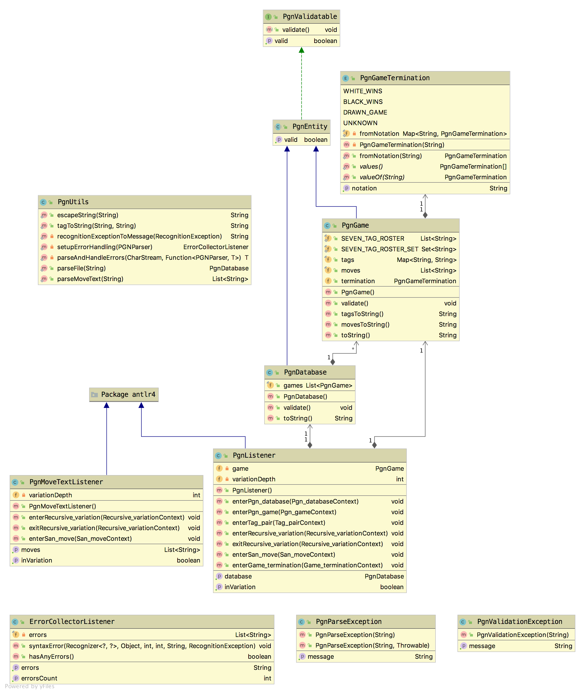
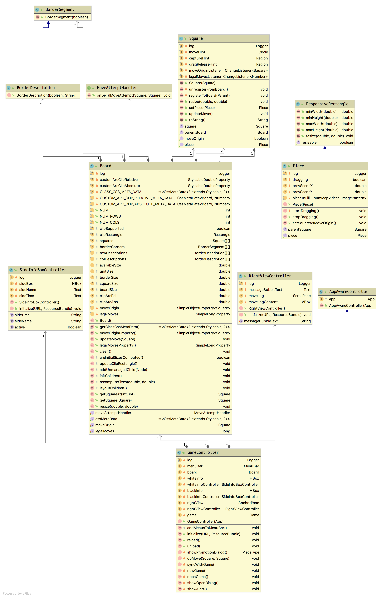

# Technical Manual

The Chess App is a Java desktop application powered by [JavaFX](https://openjfx.io/).


## Content

<!-- START doctoc generated TOC please keep comment here to allow auto update -->
<!-- DON'T EDIT THIS SECTION, INSTEAD RE-RUN doctoc TO UPDATE -->

- [Development](#development)
  - [Running from CLI using Maven](#running-from-cli-using-maven)
  - [Using with IDE](#using-with-ide)
  - [Auto restarting on source code changes](#auto-restarting-on-source-code-changes)
  - [Building a release JAR](#building-a-release-jar)
  - [Makefile](#makefile)
- [Used technologies and libraries](#used-technologies-and-libraries)
- [Javadoc](#javadoc)
- [App architecture](#app-architecture)
  - [package: `cz.martinendler.chess.engine`](#package-czmartinendlerchessengine)
  - [package: `cz.martinendler.chess.pgn`](#package-czmartinendlerchesspgn)
  - [package: `cz.martinendler.chess.ui`](#package-czmartinendlerchessui)

<!-- END doctoc generated TOC please keep comment here to allow auto update -->


## Development

**Requirements:**
* **Apache Maven 3.6+**
* **Java 11+** (tested with **Java 15**, note: Java 8 will NOT work)
* Make sure `JAVA_HOME` is properly set to a JDK 11+ installation directory. 


### Running from CLI using Maven

The project can be **run** using Maven CLI as follows:
```bash
mvn clean && mvn compile && mvn javafx:run
```


### Using with IDE

The project can be also **imported into Intellij IDEA** (_Open or Import_ or _File > New > Project from existing sources ..._ then select Maven ...).


### Auto restarting on source code changes

There is also [hot.sh](../hot.sh) script that allows automatically rerunning the project on source changes.
It requires [nodemon](https://nodemon.io/) to be installed globally (via Node.js's npm or Yarn).  
Usage _(run from the project root)_:
```bash
./hot.sh [arguments]
```
All arguments are translated to `mvn javafx:run [arguments]`.
For example, for easier development, one might want to use the following command:
```bash
CHESS_UI_POSITION='-1500:100' ./hot.sh '-Djavafx.args=--open=/absolute/path/to/sample-file.pgn'
```
For more info about `CHESS_UI_POSITION` and `--open` option, see the code of `cz.martinendler.chess.App` class.


### Building a release JAR

The **executable fat JAR (i.e. all dependencies included) can be built** using:
```bash
./build.sh
```
The executable JAR with all dependencies output is `target/chess-1.0-SNAPSHOT-jar-with-dependencies.jar`.

It can be run as follows:
```bash
java -jar target/chess-1.0-SNAPSHOT-jar-with-dependencies.jar
```


### Makefile

The project level [Makefile](../Makefile) defines these commands:
* `make export` – exports the whole repository as ZIP,
    output: `export/endlemar-pjv-semestral-work-chess-[version via git describe].zip`
* `make doc` – generates HTML Javadoc in `docs/javadoc/dist` that is ready to be deployed
* `make doc-deploy` – deploys `docs/javadoc/dist` to Netlify
* `make clean` – cleans `make export` and `make doc` outputs

See the [Makefile](../Makefile) definition for more details.


## Used technologies and libraries

* Java 15
* [Apache Maven 3.6+](https://maven.apache.org/)
* [JavaFX 15](https://openjfx.io/)
* [JUnit 5](https://junit.org/junit5/) for unit tests
* [slf4j](http://www.slf4j.org/) and [logback](http://logback.qos.ch/) for logging
* [ANTLR v4](https://github.com/antlr/antlr4) for generating parser for PGN format from CFG grammar description


## Javadoc

Built HTML Javadoc can be found at [endlemar-pjv-chess-javadoc.netlify.app](https://endlemar-pjv-chess-javadoc.netlify.app/).


## App architecture

The game logic (chess rules) is independent of the GUI.

The following diagram briefly describes the packages and the classes:
```text
cz.martinendler.chess
├── engine - game logic
│   ├── board - board logic
│   │   ├── Bitboard - bit operations
│   │   ├── Board - board state (chess position)
│   │   ├── DiagonalA1H8
│   │   ├── DiagonalH1A8
│   │   ├── File
│   │   ├── Rank
│   │   └── Square
│   ├── move - move logic
│   │   ├── Move
│   │   ├── MoveConversionException
│   │   ├── MoveGenerator
│   │   ├── MoveGeneratorException
│   │   ├── MoveLogEntry
│   │   └── SanUtils - SAN encoding and decoding
│   ├── pieces
│   │   ├── Piece
│   │   └── PieceType
│   ├── Castling
│   ├── CastlingRight
│   ├── Game - board wrapper with history support to be used by UI
│   ├── Notation
│   └── Side
├── pgn - PGN parsing and encoding
│   ├── antlr4 - generated PGN lexer and parser using ANTLR v4
│   ├── entity - PGN entities representation
│   │   ├── PgnDatabase
│   │   ├── PgnEntity
│   │   ├── PgnGame
│   │   ├── PgnGameTermination
│   │   └── PgnValidatable
│   ├── ErrorCollectorListener
│   ├── PgnListener
│   ├── PgnMoveTextListener
│   ├── PgnParseException
│   ├── PgnUtils - PGN parsing and string escaping
│   └── PgnValidationException
├── ui - GUI (JavaFX)
│   ├── controllers - FXML controllers
│   │   ├── AppAwareController
│   │   ├── GameController
│   │   ├── RightViewController
│   │   └── SideInfoBoxController
│   ├── Board - represents the chessboard view
│   ├── BorderDescription - represents a border segment with a text description
│   ├── BorderSegment - represents a border segment of the chessboard
│   ├── ChessClock - chess clock implementation
│   ├── MoveAttemptHandler
│   ├── MoveLogEntry
│   ├── Piece - represents a chess piece that can be placed on a square
│   ├── ChessClock - chess clock implementation
│   └── Square - represents a square on the chessboard
├── utils - other utils
│   └── StringUtils - string utils
├── App - JavaFX application, entrypoint
├── ControllerFactory - handles dependency injection for FXML
└── Main - entrypoint (calls App.main()) (bug workaround, see Main code)
```


### package: `cz.martinendler.chess.engine`

A chess engine that uses [bitboards](https://www.chessprogramming.org/Bitboards) to represent the state
and efficiently validate the rules. The most of the code lives in `Board` class that represents a chess position.

_It was designed with help of [Chess Programming WIKI](https://www.chessprogramming.org/).
A lot of inspiration and some pieces of code (though much rewritten) come
from [github.com/bhlangonijr/chesslib](https://github.com/bhlangonijr/chesslib)._




### package: `cz.martinendler.chess.pgn`

`PgnUtils` class offers static methods for parsing PGN files.
The lexer, tokenizer and parser are automatically generated from PGN context-free (CF) grammar file.
The conversion from the Abstract Syntax Tree (AST) is implemented using "listener pattern" in `PgnListener`.

The subpackage `cz.martinendler.chess.entitiy` contains definitions for common PGN entities.
They work as simple DTOs and implement `PgnValidatable` interface that allows easy entity-specific validation.
On top of that can also be converted back to a valid PGN via their `toString()` methods.




### package: `cz.martinendler.chess.ui`

_Note: Only chessboard related classes are shown and described._

`Board` represents the chessboard. It extends from `javafx.scene.layout.Region`.
It handles positioning of its children nodes (instances of `Square` and `BorderSegment`) in `layoutChildren()`.
It is **fully responsive** (It automatically adapts the layout according to the available width from its parent).
 
`Sqaure` represents a square on the chessboard. It is a container for a `Piece`.
When a `Piece` is dropped on a `Sqaure`, the `Square` make the `Piece` its child node.

`GameController` (with the help of other controllers) wires everything together (connects the UI and the engine).



