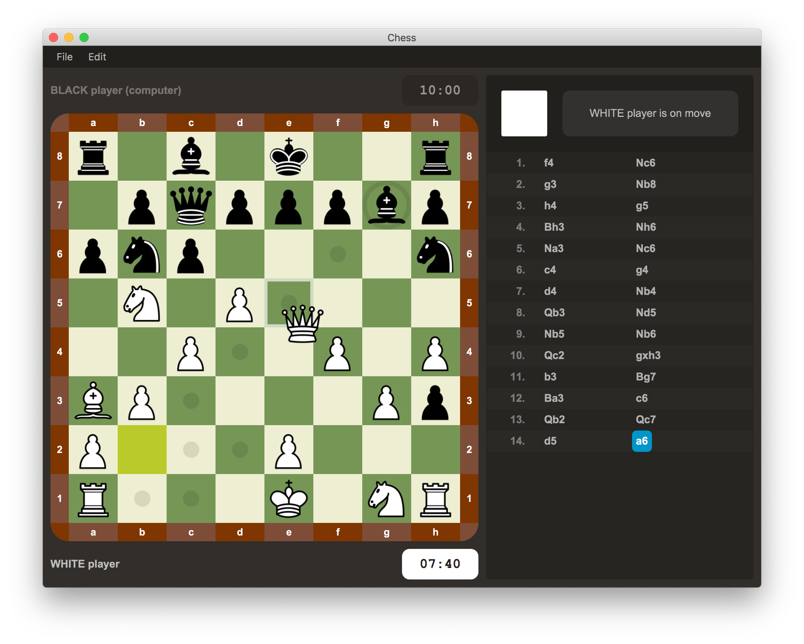
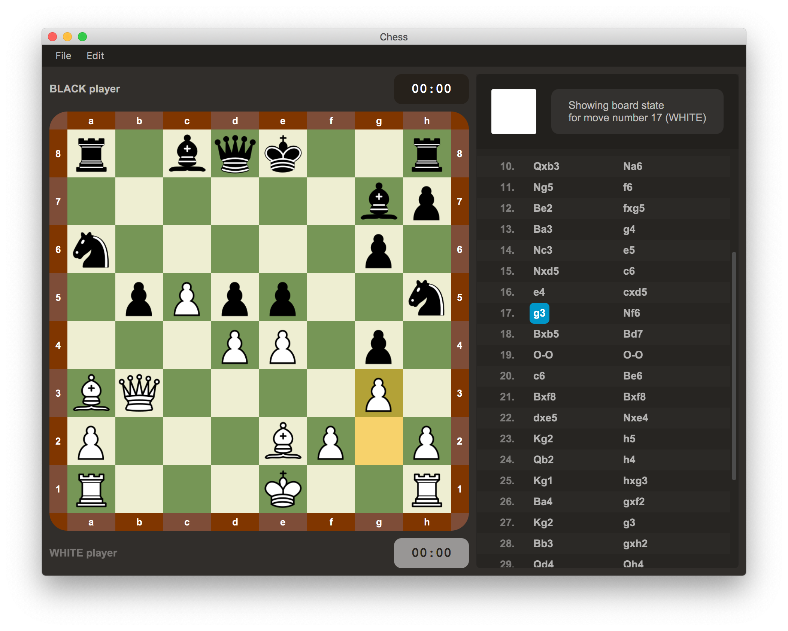

# User Manual for Chess App

The Chess App allows to play the standard [**Chess** board game](https://en.wikipedia.org/wiki/Chess).
It implements all standard chess rules as defined
by [FIDE Laws of Chess taking effect from 1 January 2018](https://handbook.fide.com/chapter/E012018)
(see also Wikipedia's [Rules of chess](https://en.wikipedia.org/wiki/Rules_of_chess))
(except fifty-move rule, insufficient material rule,  threefold repetition rule).

The app offers **a simple responsive GUI** with **drag-and-drop** support.

## Installation

The Chess App is a platform independent desktop application. It supports **macOS, Linux, Windows**.

The app is distributed as a single JAR with no dependencies.
However, a JRE 11+ is needed for running it.

_Note:_ In the future, we might ship a platform specific executable with a bundled JRE.

## Game modes

The app offers several game modes:
1. **local two-player game, human vs human**
    * In this mode, two players can play on the same computer taking turns.
2. **human vs computer (random legal moves generator)**
    * In this mode, a player can play against a random legal moves generator.
3. **(not implemented yet)** **human vs computer against an arbitrary chess engine (via [UCI](https://www.shredderchess.com/chess-features/uci-universal-chess-interface.html))**
    * In this mode, a player can play against an arbitrary chess engine
        that supports [UCI (Universal Chess Interface)](https://www.shredderchess.com/chess-features/uci-universal-chess-interface.html) (such as [Stockfish](https://stockfishchess.org/)).
    * The engine must be installed manually.

## Features

* **Complete and correct implementation of all Chess rules**
    * [FIDE Laws of Chess taking effect from 1 January 2018](https://handbook.fide.com/chapter/E012018)
    * Wikipedia's [Rules of chess](https://en.wikipedia.org/wiki/Rules_of_chess)
    * Note! The following rules are not implemented:
      fifty-move rule, insufficient material rule, threefold repetition rule.

* **Intuitive chessboard**
    * Two **possibilities for moving pieces** on the board:
        1. **Drag-And-Drop**
        2. Selecting a piece to move with a click and then selecting a target square with another click.
    * **(not implemented yet)** The **chessboard can be rotated** (by 180 degrees) at any time.
* **Moves log**
    * All moves all logged. In mode 1, also undoing of the last _n_ moves is supported.
    * Click on the move, one can view the board state after that move (which is also highlighted).
* **Saving and loading of the game state**
    * The game state can be loaded or saved to a file at any point.
    * The app supports standard [PGN](https://en.wikipedia.org/wiki/Portable_Game_Notation) format.
* **Game editor**
    * Chess pieces can be **manually placed** on the board before starting the game (using FEN).
    * Any possible (even legally impossible) placement is allowed (e.g. more pieces).
    * The currently running game can be **stopped, edited and then restarted** with the changed state.
* **Chess clock**
    * There is an option to use chess clock during the game.
    * The amount of time is configurable.

## Using the app

Upon the app startup, a _New Game Dialog_ is shown.

### App menu

The app has one global app menu. Its position depends on the platform
(e.g. on macOS standard system top-screen menu is used).

The menu offers the following options _(corresponding keyboard shortcuts are in parentheses)_:
* File
    * New Game... _(Ctrl-N / Cmd-M)_
    * Open...  _(Ctrl-O / Cmd-O)_
    * Save  _(Ctrl-S / Cmd-S)_
    * Save As... _(Ctrl-Shift-S / Cmd-Shift-S)_
* Edit
    * Undo Move _(Ctrl-Z / Cmd-Z)_

### Game screen

When a game is started (either via _New Game..._ or _Open..._),
the game screen with the chessboard moves log is shown.

_**An example of moving a piece:**_

_**An example of browsing a game moves history:**_

### Option: Help > Preferences

The _Preferences dialog_ is shown. It allows to modify the following global options
that affect app behavior:
* Highlight Last Move _(on/off)_
* Play Sounds _(on/off)_
* Show Legal Moves _(on/off)_

### Option: File > New Game...

New game can be created from the app menu using the option _File > New Game..._.

Before a new game is created, user is presented with the **New Game Dialog**.
The **New Game Dialog** allow to choose the _game mode_ and other relevant options
(such as custom initial pieces placement, chess clock config, UCI, ...).

### Option: File > Open...

The user is presented with a standard system file dialog to choose a game file to open.
Only files with a `.pgn` extension are supported.

### Option: File > Save

The game state is saved to the game file that is associated with it.
If no game file that is associated with the game, then the option behaves as _Save As..._
and the chosen game file is then associated with the game. 

### Option: File > Save As...

The user is presented with a standard system file dialog to choose where to save the game.

### Option: Edit > Undo Move

Only available in game mode 1 and 2.
Undoes the latest move in the moves log.
Can be used repeatedly as long as there are moves to undo in the moves log.

